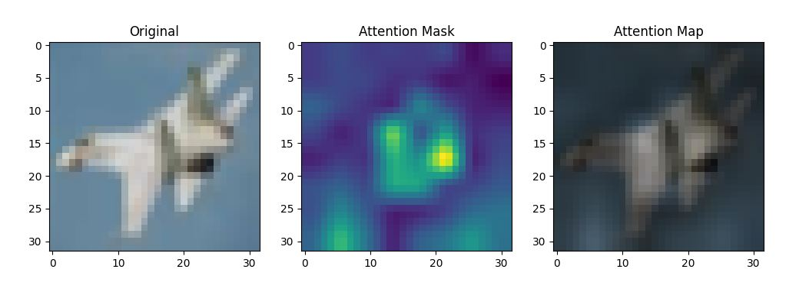

## What do the components of transformer do in vision transformer?

The goal of this repo is to find the analysis of various components of ViT (e.g. cls token, pos embedding..)

### Set training environment

```
- batch : 128
- lr : 1e-3
- epoch : 50
- optimizer : adamw
- betas : (0.9, 0.999)
- weight_decay : 5e-2
- lr scheduler : cosine scheduler(min : 1e-5)
- loss : cross entropy
- model : Vit 
```

### model 

- ViT(Vaswani) : [paper](https://arxiv.org/pdf/1706.03762.pdf)


### Results

##### attention 



##### MNIST

| model               | Batch size     | resolution | Top1-Acc          | Top5-Acc | Val Loss    | Params  |
|---------------------|----------------|------------|-------------------|----------|-------------|---------|
| ViT(vaswani)        | 128            | 28 x 28    | -                 | -        | -           | 2692426 | 

##### CIFAR10

| model               | Batch size     | resolution | Top1-Acc          | Top5-Acc | Val Loss    | Params  |
|---------------------|----------------|------------|-------------------|----------|-------------|---------|
| ViT(vaswani)        | 128            | 32 x 32    | 0.9358            | -        | 0.6579      | 2692426 | 
| ViT(paper)          | 128            | 32 x 32    | 0.9379            | -        | 0.6579      | 2692426 | 
| ViT(tomvit)         | 128            | 32 x 32    | 0.9474            | -        | 0.6325      | 2692426 | 
| ViT(+ae)            | 128            | 32 x 32    | 0.9515            | -        | 0.6325      | 2692426 | 

```
--config ./configs/cifar10/1011_tomvit_t_t_t.txt
--config ./configs/cifar10/1011_tomvit_f_t_f.txt
...
--config ./configs/cifar10/1011_tomvit_f_f_f.txt
--config ./configs/cifar10/1011_tomvit_f_f_f_t.txt
```

##### CIFAR100

| model               | Batch size     | resolution | Top1-Acc          | Top5-Acc | Val Loss    | Params  |
|---------------------|----------------|------------|-------------------|----------|-------------| ------  |
| ViT(vaswani)        | 128            | 32 x 32    | 0.7278            | -        | -           |         |
| ViT(xavier)         | 128            | 32 x 32    | 0.7047            | -        | -           |         |
| ViT(tft)            | 128            | 32 x 32    | 0.7047            | -        | -           |         |
| ViT(paper)          | 128            | 32 x 32    | 0.7381            | -        | -           |         |
| ViT(tomvit)         | 128            | 32 x 32    | 0.7539            | -        | -           |         |
| ViT(tomvit+ae)      | 128            | 32 x 32    | 0.7721            | -        | -           |         |

##### ablation for tomvit

| model               | Cls token | Last norm  | Basic pe   | Batch size    | Resolution | Top1-Acc          | Top5-Acc | Val Loss    |Params|
|---------------------|-----------|------------|------------|---------------|------------|-------------------|----------|-------------|------|
| ViT(ttt)            |True       |True        |True        | 128           | 32 x 32    | 72.78             | -        | -           |      |
| ViT(ttf)            |True       |True        |False       | 128           | 32 x 32    | 72.61             | -        | -           |      |
| ViT(tft)            |True       |False       |True        | 128           | 32 x 32    | 73.47 (+0.69)     | -        | -           |      |
| ViT(tff)            |True       |False       |False       | 128           | 32 x 32    | 73.37 (+0.59)     | -        | -           |      |
| ViT(ftt)            |False      |True        |True        | 128           | 32 x 32    | 74.46 (+1.68)     | -        | -           |      |
| ViT(ftf)            |False      |True        |False       | 128           | 32 x 32    | 75.64             | -        | -           |      |
| ViT(fft)            |False      |False       |True        | 128           | 32 x 32    | 76.10             | -        | -           |      |
| ViT(fft)            |False      |False       |False       | 128           | 32 x 32    | 75.39             | -        | -           |      |

```
python main.py --config ./configs/cifar100/cifar100_tomvit_t_t_t.txt --gpu_ids 0
python main.py --config ./configs/cifar100/cifar100_tomvit_f_f_f_t.txt --gpu_ids 1
python main.py --config ./configs/cifar100/cifar100_tomvit_t_t_t_x.txt --gpu_ids 2
python main.py --config ./configs/cifar100/cifar100_tomvit_f_f_f.txt --gpu_ids 3
python main.py --config ./configs/cifar100/cifar100_tomvit_f_f_f_t2.txt --gpu_ids 0
python main.py --config ./configs/cifar100/cifar100_tomvit_f_f_f_t_dae.txt --gpu_ids 1
python main.py --config ./configs/cifar100/cifar100_tomvit_t_f_t.txt --gpu_ids 1
python main.py --config ./configs/cifar100/cifar100_tomvit_t_t_f.txt --gpu_ids 0
python main.py --config ./configs/cifar100/cifar100_tomvit_f_t_t.txt --gpu_ids 2
python main.py --config ./configs/cifar100/cifar100_tomvit_t_f_f.txt --gpu_ids 3
python main.py --config ./configs/cifar100/cifar100_tomvit_f_f_t_t.txt --gpu_ids 0
```

| model               |  Batch size    | Resolution | Top1-Acc          | Top5-Acc | Val Loss    |Params|
|---------------------|----------------|------------|-------------------|----------|-------------|------|
| ViT(fttft)          |  128           | 32 x 32    | 77.81             | -        | -           |      |
| ViT(ffftt)          |  128           | 32 x 32    | 79.04             | -        | -           |      |
| ViT(ftttff)         |  128           | 32 x 32    | 74.58             | -        | -           |      |
| ViT(ffftff)         |  128           | 32 x 32    | 75.57             | -        | -           |      |

#### Imagenet1K

| Model          | Batch size     | Resolution | Top1-Acc          | Top5-Acc | Val Loss | Params            |
|----------------|----------------|------------|-------------------|----------|----------| ----------------- |
| ViT(B)         | 256            | 224 x 224  | 77.31             | -        | -        | 86540008 (86.5M)  |
